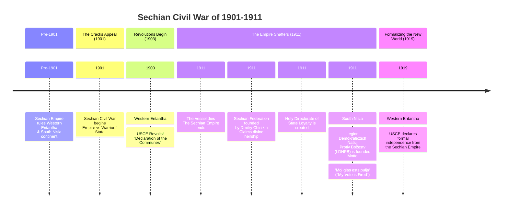

The Sechian Civil War was an armed conflict that took place from 1901 to 1911, resulting in the dissolution of the Sechian Empire. The war involved multiple factions, including the imperial government, a secessionist military junta known as the Warriors' State, and various anti-theocratic revolutionary movements.

## Background
The Sechian Empire, a long-standing theocratic monarchy, faced internal dissent due to economic disparities, political repression, and religious authoritarianism. In 1901, a faction within the imperial military, the Warriors' State, rebelled against the central government, triggering a wider conflict.

## Major Factions
### Imperial Faction
The ruling government of the Sechian Empire, led by the Vessel and supported by the state clergy, sought to preserve the empire's territorial and doctrinal integrity.

### Warriors' State
A breakaway military faction that declared autonomy in 1901, challenging the imperial authority and contributing to the destabilization of the central government.

### Revolutionary Factions
- **Union of Societist Communes of Entantha (USCE):** A societist movement that declared independence in Western Entantha in 1903, advocating for cooperative ownership and direct democracy.
- **Legion of Democratic Nations Against Divinity (LDNPB):** An anti-theocratic movement founded in South Nisia in 1911, promoting militant democratic principles.

## Timeline of Key Events

## Phases of the Conflict
### Initial Phase (1901–1903)
The conflict began as a military rebellion by the Warriors' State, weakening the imperial structure and creating opportunities for broader opposition.

### Revolutionary Phase (1903–1908)
The USCE's Declaration of the Communes in 1903 formalized its secession, opening a second front. The war expanded into an ideological struggle over governance and societal organization.

### Collapse of the Empire (1909–1911)
The death of the Vessel in 1911 led to the disintegration of imperial authority, resulting in the fragmentation of the empire.

### Post-Imperial Consolidation (1911–1919)
The war transitioned into a period of border conflicts and diplomatic negotiations as successor states established their sovereignty. The USCE formally declared independence in 1919.

## Aftermath
The war concluded with the emergence of new political entities:
- **Sechian Federation:** A successor state claiming continuity with the empire, founded by Dmitry Chistkin.
- **Union of Societist Communes of Entantha:** A societist state based on communal resource allocation and cooperative governance.
- **Legion of Democratic Nations Against Divinity:** An anti-theocratic force that consolidated power in South Nisia.

The Sechian Civil War is widely regarded as a pivotal event in modern history, reshaping the geopolitical landscape and establishing enduring ideological divisions.

