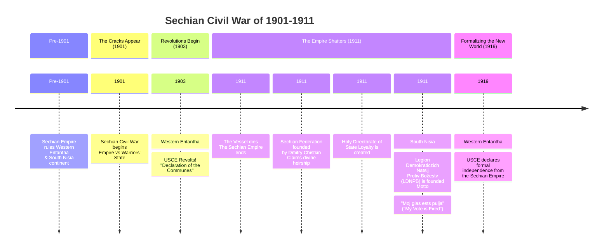

The **[Sechian](Sechia) Civil War** was a decade-long period of immense conflict and upheaval that resulted in the total collapse of the centuries-old **Sechian Empire**. It was characterized by a three-way struggle between the Imperial government, a militaristic "Warriors' State," and burgeoning revolutionary movements, culminating in a fundamental reordering of the political landscape across multiple continents.

## Overview

The war began as an internal power struggle within the Sechian Empire but rapidly evolved into a revolutionary conflagration. The Empire's brutal and theocratic rule, combined with its failure to address widespread economic hardship and social inequality, had created deep-seated resentment across its territories. The initial conflict between the Imperial throne and a secessionist military faction provided the opening for long-suppressed revolutionary forces to rise up, leading to a multi-front war that the overstretched Empire could not contain.

## Major Phases & Belligerents

### The Imperial Faction
The ruling government of the **Sechian Empire**, centered on the divine authority of the **Vessel** and the state clergy. It fought to maintain the unity of the empire and its theocratic doctrine.

### The Warriors' State
A schismatic military faction that rebelled in 1901. While its specific ideology is not detailed in public records, its emergence as a distinct military power from within the Imperial structure critically weakened the central government and signaled its vulnerability.

### The Revolutionary Factions
*   **The [[Union of Societist Communes of Entantha|USCE]]:** A societist movement that declared its revolt in Western Entantha in 1903 with the **[[Declaration of the Communes of Entantha (1903)|Declaration of the Communes]]**. It advocated for the abolition of hierarchy, cooperative ownership, and direct democracy.
***[The Legion Demokraticzich Natsij Protiv Božestv (LDNPB)](Legion%20Demokraticzich%20Natsij%20Protiv%20Božestv):** An anti-th...eocratic movement founded in South Nisia in 1911, espousing a militant, direct-action form of democracy, summarized by their motto "Moj glas ests pulja" ("My Vote is Fired").

# Aftermath & Legacy

The war's conclusion in 1911 saw the complete dissolution of the Sechian Empire and the birth of new, ideologically opposed states:

- **The [[Sechian Federation]]:** Founded by Dmitry Chistkin, this successor state claims divine heirship to the Empire and maintains its theocratic structure through institutions like the **[[Holy Directorate of State Loyalty]]**.
    
- **The [[Union of Societist Communes of Entantha]]:** A revolutionary **societist** state that formalized its independence in 1919. It built a new society based on communal resource allocation and cooperative labor.
    
- **The [[Legion Demokraticzich Natsij Protiv Božestv]]:** A powerful anti-theocratic force in South Nisia, representing a third ideological pole born from the empire's collapse.
    

The Sechian Civil War remains the defining event of modern history on [[Xenert]], setting the stage for ongoing ideological and political tensions in the post-imperial era.